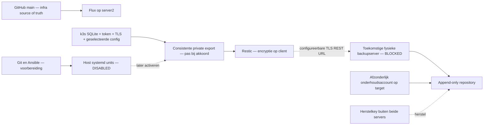

# Server2 — Backup-ready architectuur

Datum: 9 oktober 2026. Dit ontwerp vervangt de eerdere laptopbestemming. Eigenaar besluit: later een extra fysieke backupserver; voorlopig bewust geen externe backups. Alleen server2 (`mau2`, `192.168.0.162`); server1 volledig uitgesloten. Geen laptop/cloud als verplichte tijdelijke bestemming.

## 1. Status en doel

| Status | Betekenis | Huidige situatie |
|---|---|---|
| READY | Configuratie lokaal voorbereid | Ansible-role, templates, guarded runner en contractspecificatie aanwezig. |
| DISABLED | Bewust niet actief | Geen installatie/deployment; timers niet geactiveerd; configuratie `enabled=false`. |
| BLOCKED | Wacht op benodigde voorziening | Externe server, opslag/TLS/credentials, monitoringkeuze en activatiegoedkeuring. |
| UNTESTED | Geen operationele bewijsvoering | Alle backups, deployment/idempotentie, WAL-loadtest en restores. |
| VERIFIED | Daadwerkelijk gecontroleerd | Alleen Git/Flux/hostidentiteitbevindingen hieronder, geen backupketen. |

Voorkeur: **Restic → configureerbare TLS REST endpoint → toekomstige Linux-backupserver met append-only rest-server**. Host-systemd voert uit buiten Kubernetes; Ansible levert software/config bij afzonderlijk goedgekeurde deployment. Git bewaart uitsluitend niet-gevoelige configuratie. Alleen een externe, geïnitialiseerde en gepinde repository is toegestaan; geen stille lokale fallback.

## 2. GitHub source-of-truth: gecontroleerd op 9 oktober 2026

| Controle | Status/bewijs | Resultaat |
|---|---|---|
| Lokale branch/remote | VERIFIED: git metadata | `main`, origin `git@github.com:mauricevanlavieren/server2-platform.git`. |
| Laatste lokale commit op GitHub | VERIFIED: `git ls-remote` | Lokale HEAD en GitHub main: `53f9a8e05d15afa92e9ce175f46bfde6f0a43acb`. Geen fetch/commit/push. |
| Flux repository/branch/revision | VERIFIED: expliciet `kubectl --context server2`, geen Secret-read | GitHub SSH URL, branch main, dezelfde SHA; GitRepository Ready=True. |
| GitHub privacy | VERIFIED: GitHub API via `gh repo view` | **Publiek** (`isPrivate=false`). Niet gewijzigd; eigenaar beslist of private gewenst is. |
| Hostidentiteit | VERIFIED: read-only SSH | mau2, LAN-IP .162. Geen server1 benaderd. |
| Bestaande backups | Beperkte inspectie | Restic-command niet aangetroffen; geen backupimplementatie in bestaande Git. Ubuntu `dpkg-db-backup.timer` aanwezig: lokaal pakketdatabaseonderhoud, geen externe k3s/PVC-backup. Volledige root-service/croninventaris niet opnieuw vastgesteld. |
| Secretcontrole | Statische scan van tracked werkboom en nieuwe voorbereiding | Geen secretwaarden gerapporteerd; precieze scope/resultaat in README-validatie. Geen garantie voor Gitgeschiedenis, externe secrets of niet-leesbare hostbestanden. |

### Reproduceerbaarheid A–D

| Categorie | Wat | Beperking/actie |
|---|---|---|
| A — Uit Git definieerbaar | Flux controllers/sync, Kustomize infrastructure/apps, gateway HelmRelease; prerequisites, pod-firewallregels, k3s-versionplaybook en CLIinstallers | Manifests aanwezig betekent niet geteste bare-metal herbouw. Traefik/local-path volgen k3s defaults. |
| B — Nog handmatig/onvolledig | Ubuntuinstallatie/LVM, account/SSH-hardening, volledige UFWbasis, tijd/updates, resolver/netwerk/BIOS, onafhankelijke Flux-auth bootstrap | baseline.yml controleert vooral; k3s installer niet volledig gepind, mismatch kan downgrade veroorzaken; kubeconfigscript overschrijft globale config. Niet aangepast. |
| C — Niet in Git | SQLite/WAL-state, server token/CA/private keys, Kubernetes Secrets, toekomstige PVC/appDB/Forgejo-data, backupcredentials | Later externe versleutelde backup en onafhankelijk credentialherstel nodig. GitHub herstelt deze niet. |
| D — Niet gepusht | Vijf Dashy YAML-deleties, gewijzigde apps/kustomization.yaml, audit/improvementdocs, backup/DRdocs en nieuwe backupvoorbereiding | Bestaande wijzigingen behouden; geen commit/push. GitHub/Flux hebben deze lokale gewenste toestand nog niet. |

README is historisch: vermeldt oud DNSadres en nog niet geïnstalleerde k3s/Flux. Audit sec.13 is actueler dan eerdere tussenstanden. Die bestanden blijven intact; dit document corrigeert geen overige configuratie zonder opdracht.

## 3. Keuze en transport

Restic past bij hostmatige exports, client-side encryptie, deduplicatie en onafhankelijk herstel. Kopia is bruikbaar maar voegt een ander beleidsmodel toe; Borg is sterk voor Unix/SSH maar geen reden om twee engines te onderhouden. Velero voegt nu controller/plugins toe zonder host/SQLite-bootstrap volledig te dekken. SQLite Online Backup API blijft nodig naast de backupengine.

Voor toekomstige Linux-server voorkeur **rest-server**: native Restic transport, TLS, private repos, append-only en quota; backupclient hoeft geen algemene SSH-shell te krijgen. SFTP is mogelijk bij later gewijzigde requirements, maar standaard SFTP biedt niet dezelfde append-only grens. NAS/S3 zijn geen verplichte tussenstap. De runner ondersteunt nu uitsluitend `rest:https://`; host/URL/CA/repository-ID zijn configureerbaar, backenduitbreiding vereist reviewed adapter en credentialschema, geen complete scriptrewrite.

Bronnen: [Restic REST transport/auth/TLS](https://restic.readthedocs.io/en/stable/030_preparing_a_new_repo.html), [rest-server](https://github.com/restic/rest-server), [SQLite backup API](https://www.sqlite.org/backup.html).

## 4. Voorbereide implementatie en safe defaults

Locaties: `bootstrap/ansible/backup-prepare.yml`, `bootstrap/ansible/roles/backup/`, `bootstrap/backup/README.md` en `bootstrap/backup/examples/`.

- Playbook target uitsluitend server2, identiteit/Ubuntuasserties en expliciete deploymentapproval. Nu niet uitgevoerd. Restic-packageversie moet vóór deployment worden gekozen; geen ongereviewde latestdownload.
- Role weigert activering. Default enabled=false, repository/destination/repository-ID leeg. Bij toekomstige uitvoering: credentialloze directories, runner/templates en units; timers stopped/disabled. Geen repository-init, credentialgeneratie of automatische jobs.
- Units zonder `[Install]`, geen startup hook; een latere activatiechange moet expliciet worden gereviewd. Ook check/freshness-timers blijven uit.
- Runner weigert disabled/ontbrekende config, lokale/HTTPbackend, URLcredentials, verkeerde doelhost/repository-ID, ontbrekende CA of root-only credentials. Geen backendfallback; fouten nonzero zonder geheime foutoutput.
- TLS REST-auth via systemd credentials, niet commandline of Git. Repository-ID voorkomt accidenteel gebruik van een andere bestaande repository. Host/DNSguards zijn geen bescherming tegen alle routing/DNSaanvallen; TLS en targetfirewall blijven vereist.
- Flock voorkomt gelijktijdige clientbackup/check; timeout begrenst runs. Geen automatische retries geïmplementeerd, volgende geplande run is later de volgende poging; een eventueel retrybeleid krijgt een maximum.

## 5. Dataset en consistentie

| Dataset | Nu voorbereid | Nog nodig vóór bescherming |
|---|---|---|
| SQLite | Python Online Backup API clone, integrity_check op clone, geen live raw copy | WAL-belastingtest en exact-version k3s restoretest. |
| Herstelmateriaal | Mandatory token/TLS inventory en checksum vóór/na; opname in versleutelde dataset | Volledige effectieve config/keyinventaris; rotatie-interlock. Toekomstige secrets-encrypt keyfiles buiten allowlist expliciet toevoegen. |
| Hostconfig | Gerichte SSH/UFW/netplan/k3s/serviceconfig-opname | Volledige Ansiblehostbasis; effectieve environment/config en optionele ontbrekende paden beoordelen. Geen hostimage. |
| Git/Flux | GitHubverified bron + DRinstructies | Onafhankelijke Git bundle en GitHub/2FA/Flux-authherstel. Geen automatische bundletaak nu. |
| PVC/apps | Contracttemplate, runner weigert niet-lege onbewezen contracten | Native DB-exporter, PVC/PV UID/pad/ownerinventory, quiesce/resume en coherent receipt. Geen raw hot-volume fallback. |
| Forgejo | Voorbereide contracteisen | Nog geen installatie/versie/database; repos, DB, attachments/LFS/packages en config samen testen. |

SQLite-export is een standalone clone met committed WAL-transacties verwerkt; originele WAL/SHM horen niet naast deze clone. Bron readonly, begrensde looptijd, clone integrity_check moet ok zijn. K3s backup heeft matching server token nodig. [Python SQLite backup](https://docs.python.org/3/library/sqlite3.html), [k3s backup/restore](https://docs.k3s.io/datastore/backup-restore).

Tijdelijke exports alleen tijdens later goedgekeurde backupuitvoering, in private root-only 256MiB tmpfs met `noswap`; systemd mount en runner verifiëren dit. Geen disk/swapfallback; 512MiB-servicebudget en no-coredump. Ondersteuning/bron-WAL-toegang en echte datasetgrootte UNTESTED. Cleanup verwijdert uitsluitend nieuw gemaakte staging; geen productiebronverwijdering. Restic heeft lokale cache uit; permanente status bevat alleen IDs/tijd.

Eén succesvolle cluster-candidate plus off-host receipt wijst de volledige herstelgeneratie aan. Exitcode anders dan nul, ontbrekende summary/receipt of gewijzigde recoverykeys betekent geen successstatus. Partial kandidaten mogen niet voor restore worden gekozen. Targetonderhoud moet candidate/receipt samen bewaren en target-side ontvangstlog later invoeren. Clientchecksums detecteren concurrente wijziging, geen bescherming tegen reeds gecompromitteerde bron.

Forgejo/native databases vereisen appconsistente exports en samenhangende filesets. Native DBtools gebruiken, niet blind vertrouwen op `forgejo dump` SQLrestore. [Forgejo backupwaarschuwingen](https://forgejo.org/docs/latest/admin/upgrade/).

## 6. Security en onafhankelijke toegang

Restic-encryptiesleutel en RESTauth zijn verschillend. Backupclient krijgt beperkte append-only toegang; lezen/ontsleutelen van bestaande backups blijft mogelijk met zijn keys. Targetmaintenance/prune heeft aparte rechten die server2 niet krijgt. Append-only beschermt niet tegen target-root, quota-uitputting of verlies van de backupserver. Tweede onafhankelijke/off-site kopie is een latere keuze voor die scenario's; geen gerealiseerde 3-2-1 claim.

Herstelkey, targetadres/TLStrust, GitHub/2FA recovery en beheeraccount onafhankelijk van server2 en laptop bewaren. Geen secrets in Git, URL, commandline of rapport. K3s secrets-at-rest is volgens audit uit; backupencryptie verandert dit niet. Rotatieprocedure en echt masterkeycompromis apart behandelen: een nieuw wachtwoord alleen maakt een gestolen masterkey niet ongeldig.

Toekomstige target: eigen persistente disk, account, TLS, authenticatie, quota, source-filtering, backups/onderhoud gescheiden. Voorbeeldunit is geen operationeel veilige complete targetdeployment: firewall/TLS/privatekeys/binarysizing/monitoring ontbreken bewust. Geen vrije toegang vanaf hele LAN als standaard aannemen; pas aan na gekozen endpoint.

## 7. Planning, retentie, controle en alarmsignalen

Alle onderstaande schema's zijn **DISABLED**.

| Taak | Voorbereiding/doel | Status |
|---|---|---|
| Clusterbackup | Timer iedere 4 uur, 5min jitter, Persistent catch-up | Unit voorbereid, geen run. |
| Metadatacheck | Dagelijks 03:00 | Unit/runner voorbereid; geen full-datarestorebewijs. |
| Freshness | Uurlijks; grens 8uur | Nonzero bij missing/stale/disabled; geen notificatieontvanger gekoppeld. |
| Retentie target | Voorstel 30dag-minimum, 24recente/30dagelijkse/8wekelijkse/12maandelijkse | Niet geïmplementeerd; capaciteit en receipt/candidategroepering nog bepalen. |
| Data-integriteit | Wekelijks roterende sample, maandelijks full-data | Toekomstige targettaak, niet voorbereid als actieve job. |
| Restoretest | Vóór eerste stateful productiebackupvrijgave, daarna kwartaal | Runbook, geen destructive automationscript. |

Append-only retentie mag niet blind vertrouwen op clienttimestamps of keep-last: een gecompromitteerde bron kan die manipuleren. Onderhoud met onafhankelijke ontvangstregistratie en behoud schone herstelpunten. [Restic append-only retentie](https://restic.readthedocs.io/en/stable/060_forget.html).

Journallog/failing service is nog geen alert. Later monitoring koppelen aan exitcode, successouderdom, targetruimte/TLS, plus onafhankelijk dead-man signaal. Rapporteer nu DISABLED/BLOCKED, nooit groen omdat het stil is. Geen alerts naar derden verstuurd of diensten gekoppeld.

## 8. Kosten en implementatievolgorde

Nu: geen nieuwe abonnementen, hardware of software-installaties. Toekomstige backupserveraanschaf, diskcapaciteit, stroom en off-site kopie nog onbekend; software open source. Sizing op echte data/groei/retentie meten, voorbeeldquota is geen toezegging.

1. Ontwerp/code review en afzonderlijk akkoord; eventuele source-of-truth/privacyafwijkingen apart besluiten.
2. Nieuwe backupserver beschikbaar maken; onafhankelijk adres/DNS, disk, accounts, TLS, keyescrow, append-only en maintenance-rechten toetsen.
3. Resticversie selecteren; server2-role goedgekeurd deployen met timers uit; credentials apart injecteren en bestaande repo apart goedgekeurd initialiseren/pinnen.
4. Gecontroleerde eerste clusterbackup en herstelproef; WAL/load/failures/receiptselectie en readonly sandbox bewijzen.
5. Appcontracts en targetretentie/full-data checks/monitoring afronden en testen.
6. Pas na geslaagd bewijs en activeringsakkoord config enablement en timers expliciet in afzonderlijke change beheren.

Acceptatie: geen plaintextstaging/fallback; passende token/DB; brondelete geweigerd; alarmsignaal bij stale/incomplete/full/offline; replica op externe disk; engineer kan onafhankelijk restore uitvoeren; gemeten RPO/RTO en keyherstel. Zonder deze gates geen VERIFIED backupservice.

## 9. Voorlopig geaccepteerde risico's

Eigenaar accepteert bewust geen externe backups totdat extra server bestaat. SSDdefect/volledig hostverlies kan SQLite, secrets en toekomstige PV/appDBdata definitief vernietigen. GitHub bewaart alleen gecommitte/pushte infra. Single-node blijft zonder HA; live secret-encryptie, hostbootstrap en monitoringlacunes blijven open. Lokale voorbereiding verkleint toekomstige implementatiewerkzaamheden, biedt nu geen dataherstelbescherming.
